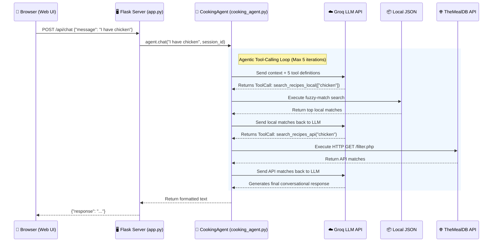

# Cooking Recipe Assistant - AI Agent
## Comprehensive Project Documentation

---

## 1. Project Overview & Goals

The **Cooking Recipe Assistant** is an AI-powered, web-based application designed to help users discover recipes based on ingredients they have at home, explore curated culinary collections, and receive step-by-step cooking instructions. 

Unlike traditional rule-based chatbots, this application is built as an **Autonomous AI Agent**. It utilizes the Groq LLM (llama-3.3-70b-versatile) paired with an agentic tool-calling loop. This allows the AI to autonomously decide when and how to query a **Dual Knowledge Base**—consisting of a local curated JSON database and the external TheMealDB API—to fetch grounded, real-time data before formulating a response.

**Core Goals:**
- **Zero-Hallucination Recipe Generation:** Ensure all recipes, ingredients, and instructions are pulled from actual databases rather than generated from the LLM's weights.
- **Intuitive User Experience:** Provide a premium, Cortex-inspired web interface with dynamic interactions and seamless conversational flows.
- **Robust Architecture:** Implement a clean separation of concerns between the frontend UI, the Flask REST API, and the autonomous AI agent.
- **Extensibility:** Maintain a modular tool-calling structure that allows easy integration of future data sources or APIs.

---

## 2. Architecture Diagram

The application follows a standard client-server architecture, augmented with an AI agent loop on the backend.



---

## 3. Folder & File Structure

```text
Cooking Recipe Assistant-v1/
├── app.py                      # Application entry point. Flask web server, routing, and session management.
├── cooking_agent.py            # Core AI logic. Implements the CookingAgent class, agentic loop, and 5 tool functions.
├── recipe_knowledge_base.json  # Local Knowledge Base. Contains 25 curated recipes with detailed metadata.
├── test_app.py                 # Comprehensive test suite (39 tests) covering routing, matching, tools, and edge cases.
├── requirements.txt            # Python package dependencies (flask, groq, python-dotenv, requests).
├── .env                        # [Not tracked in Git] Environment variables (e.g., GROQ_API_KEY).
├── .gitignore                  # Git exclusion rules to prevent committing sensitive/cache files.
├── README.md                   # Quick-start guide and project summary.
├── templates/
│   └── index.html              # Frontend HTML structure. Implements a premium, responsive chat interface.
└── static/
    ├── style.css               # Frontend CSS. Uses CSS variables, glassmorphism, and custom animations.
    └── script.js               # Frontend JavaScript. Handles async fetch requests, DOM updates, and markdown parsing.
```

---

## 4. API Endpoints

The Flask backend exposes the following RESTful endpoints.

### 4.1. Serve UI
- **Endpoint:** `GET /`
- **Description:** Initializes a user session (assigns a unique `session_id`) and serves `index.html`.

### 4.2. Chat Interaction
- **Endpoint:** `POST /api/chat`
- **Description:** Sends user input to the AI Agent and returns the AI's conversational response.
- **Request Body:**
  ```json
  {
    "message": "Do you have any vegetarian recipes?"
  }
  ```
- **Success Response (200 OK):**
  ```json
  {
    "response": "Yes! From our local collection, I recommend the **Vegetable Stir Fry**... 🥗"
  }
  ```
- **Error Response (400 Bad Request):**
  ```json
  {
    "error": "Empty message. Please type a question."
  }
  ```

### 4.3. List Recipes
- **Endpoint:** `GET /api/recipes`
- **Description:** Bypasses the LLM to directly return a categorical breakdown of all recipes in the local JSON knowledge base.
- **Success Response (200 OK):**
  ```json
  {
    "source": "local_knowledge_base",
    "total_recipes": 25,
    "categories": {
      "Dinner": [
        {"name": "Butter Chicken", "cuisine": "Indian", "difficulty": "Medium", "dietary_tags": ["gluten-free"]}
      ]
    }
  }
  ```

### 4.4. Clear Session
- **Endpoint:** `POST /api/clear`
- **Description:** Wipes the conversation history for the current user session and issues a fresh session ID.
- **Success Response (200 OK):**
  ```json
  {
    "status": "cleared"
  }
  ```

---

## 5. Database Schema (JSON Structure)

Instead of a relational SQL database, this project uses a flat JSON file (`recipe_knowledge_base.json`) for local data. The schema is highly structured.

### Recipe Object Schema

```json
{
  "id": "Integer (Unique identifier)",
  "name": "String (Name of the dish)",
  "category": "String (e.g., Breakfast, Lunch, Dinner)",
  "cuisine": "String (e.g., Italian, Indian)",
  "difficulty": "String (Easy, Medium, Hard)",
  "prep_time": "String (e.g., '15 min')",
  "cook_time": "String (e.g., '30 min')",
  "servings": "Integer",
  "dietary_tags": ["Array of Strings (e.g., 'vegetarian', 'gluten-free')"],
  "ingredients": [
    {
      "name": "String (Ingredient name, used for fuzzy matching)",
      "qty": "String (Measurement)"
    }
  ],
  "instructions": [
    "Array of Strings (Ordered list of cooking steps)"
  ]
}
```
*Note: The external database (TheMealDB) uses its own schema, which the `cooking_agent.py` script parses and normalizes to match the local format before presenting it to the LLM.*

---

## 6. Setup & Installation Guide

### Prerequisites
- Python 3.10+
- A valid Groq API Key (Obtain from [console.groq.com](https://console.groq.com))

### Installation Steps
1. **Clone the repository:**
   ```bash
   git clone <repo-url>
   cd "Cooking Recipe Assistant-v1"
   ```
2. **Create a virtual environment (Recommended):**
   ```bash
   python -m venv venv
   source venv/bin/activate  # On Windows: venv\Scripts\activate
   ```
3. **Install Dependencies:**
   ```bash
   pip install -r requirements.txt
   ```
4. **Configure Environment:**
   Create a `.env` file in the root directory and add your API key:
   ```env
   GROQ_API_KEY=gsk_your_api_key_here
   ```
5. **Run the Application:**
   ```bash
   python app.py
   ```
6. **Access the UI:**
   Open a web browser and navigate to `http://localhost:5000`

---

## 7. Environment Variables & Configuration

The application relies on `python-dotenv` to load configuration safely.

| Variable | Required | Description |
|:---------|:---------|:------------|
| `GROQ_API_KEY` | **Yes** | Authenticates the backend with the Groq Cloud API. Without this, the `CookingAgent` will fail to initialize, and `/api/chat` will return 500 errors. |

*Security Note: The `.env` file is explicitly ignored in `.gitignore` to prevent credential leakage.*

---

## 8. Component & Module Breakdown

### `app.py` (Flask Routing & Sessions)
- **Role:** Web server and API gateway.
- **Key Mechanisms:**
  - Uses `uuid.uuid4()` to track user sessions via cookies.
  - Implements global error handlers (`@app.errorhandler`) for 404 and 500 status codes.
  - Lazily initializes the `CookingAgent` inside a `try/except` block to prevent server crashes if the API key is missing.

### `cooking_agent.py` (AI Logic & Tools)
- **Role:** The brain of the application.
- **Key Mechanisms:**
  - **`CookingAgent` Class:** Manages the LLM client, stores session memory (`self.sessions`), and runs the `while` loop that handles tool calls.
  - **Tool Functions:**
    - `search_recipes_local(ingredients)`: Uses `SequenceMatcher` to fuzzy-match user ingredients against the local JSON.
    - `search_recipes_api(ingredient)`: HTTP GET wrapper for TheMealDB API (`/filter.php?i=`).
    - `get_recipe_details_local(recipe_name)`: Retrieves full instructions for a local recipe.
    - `get_recipe_details_api(meal_name)`: Retrieves full instructions for an API recipe, normalizing TheMealDB's 20 ingredient fields.
    - `list_all_recipes()`: Utility to dump the local DB by category.
  - **System Prompt:** Instructs the LLM on its persona, enforces the use of tools, and mandates formatting (e.g., using emojis).

### `script.js` (Frontend State & Rendering)
- **Role:** Browser-side logic.
- **Key Mechanisms:**
  - Prevents race conditions with an `isProcessing` flag.
  - Manages automatic scrolling and dynamic textarea resizing.
  - Contains a `formatMarkdown()` regex parser that converts the LLM's markdown text (bold, headers, lists) into safe HTML.

---

## 9. User Flows & Use Cases

**Use Case 1: Pantry Search (Ingredient Matching)**
1. User types: *"I have chicken, garlic, and rice"*
2. Agent calls `search_recipes_local(["chicken", "garlic", "rice"])`.
3. Agent identifies local matches (e.g., Chicken Fried Rice - 33% match).
4. Agent simultaneously calls `search_recipes_api("chicken")` for broader coverage.
5. Agent returns a formatted list of options from both sources.

**Use Case 2: Direct Recipe Request**
1. User types: *"How do I make Butter Chicken?"*
2. Agent calls `get_recipe_details_local("Butter Chicken")`.
3. Agent returns the ingredient list and step-by-step instructions.

**Use Case 3: Dietary Exploration**
1. User types: *"Show me vegan desserts"*
2. Agent calls `list_all_recipes()`, filters the resulting JSON internally for the `vegan` tag and `Dessert` category, and presents the findings.

---

## 10. Testing Strategy & Test Coverage

The project includes a robust, zero-dependency test suite utilizing Python's built-in `unittest` framework (`test_app.py`).

**Running Tests:**
```bash
python test_app.py
```

**Coverage Breakdown (39 Total Tests):**
1. **Knowledge Base (8 tests):** Validates JSON integrity, schema compliance, and uniqueness of IDs/names.
2. **Utility Functions (5 tests):** Verifies the `fuzzy_match` algorithm's resilience to typos, casing, and whitespace.
3. **Tool Logic (13 tests):** Tests local search bounds, empty inputs, sorting logic, and detail retrieval accuracy.
4. **API Integration (4 tests):** Validates the HTTP wrappers for TheMealDB (gracefully handling network timeouts).
5. **Schema Validation (3 tests):** Ensures the Groq tool definitions (`TOOLS`) perfectly match the execution map (`TOOL_MAP`).
6. **Flask Routing (6 tests):** Validates HTTP status codes, JSON payload requirements, and session clearing logic using the Flask test client.

**Error Handling & Edge Cases Covered:**
- Empty message payloads gracefully rejected (HTTP 400).
- Unreachable external APIs caught via `requests.exceptions.RequestException` and safely communicated back to the LLM.
- Infinite LLM loops prevented via a hardcoded `max_iterations = 5` circuit breaker in the agentic loop.
